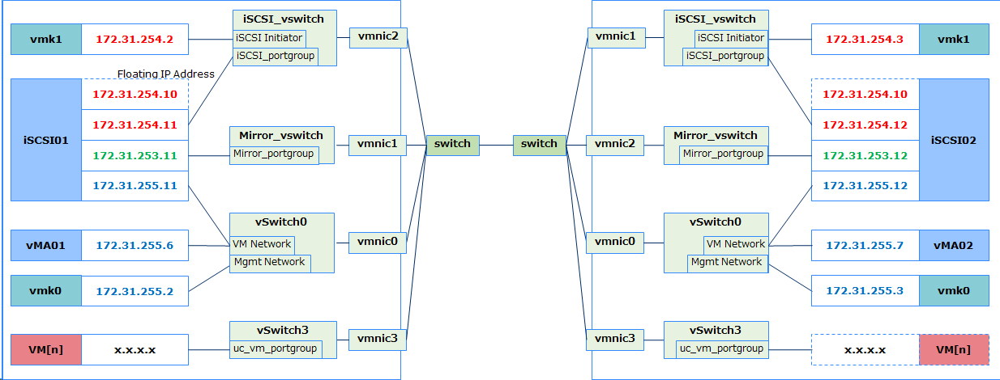

# Howto setup vMA Cluster on EXPRESSCLUSTER for Linux

This guide provides how to create Management VM Cluster on EXPRESSCLUSTER for Linux.

## Versions
- VMware vSphere Hypervisor 6.7 (VMware ESXi 6.7)
- CentOS 6.6 x86_64
- vSphere Command Line Interface 6.7
- EXPRESSCLUSTER X for Linux 4.1.1-1

## Network configuration

## Nodes configuration

|		| Primary		| Secondary		|
|---		|---			|---			|
| Hostname	| vma1			| vma2			|
| root password	| passwd1		| passwd2		|
| IP Address	| 172.31.255.6/24	| 172.31.255.7/24	|

## Overall Setup Procedure
- Creating VMs (*vma1* and *vma2*) one on each ESXi
- Install vCLI and EC on them.

## Procedure

### Creating VMs on both ESXi

|Virtual HW	|Number, Amount	|
|:--		|:---		|
| vCPU		| 2 CPU		| 
| Memory	| 4 GB		|
| vNIC		| 1 port	|
| vHDD		| 6 GB		|

On vma1 and vma2,

- Install CentOS and configure hostname, IP address, firewalld, selinux, ssh

  - on vma1

		hostnamectl set-hostnme vma1
		nmcli c m ens192 ipv4.method manual ipv4.addresses 172.31.255.6/24 connection.autoconnect yes
		systemctrl stop firewalld.service
		systemctrl disable firewalld.service
		sed -i -e 's/SELINUX=>*/SELINUX=disabled/' /etc/selinux/config 
		ssh-keygen -t rsa -f /root/.ssh/id_rsa -N ""
		reboot

  - on vma2

		hostnamectl set-hostnme vma2
		nmcli c m ens192 ipv4.method manual ipv4.addresses 172.31.255.7/24 connection.autoconnect yes
		systemctrl stop firewalld.service
		systemctrl disable firewalld.service
		sed -i -e 's/SELINUX=>*/SELINUX=disabled/' /etc/selinux/config 
		ssh-keygen -t rsa -f /root/.ssh/id_rsa -N ""
		reboot

- Install vCLI and EC
  - Download vCLI package and install according to the document
    - package
      https://code.vmware.com/web/tool/6.7/vsphere-cli  
    - document
      https://code.vmware.com/docs/6526/getting-started-with-vsphere-command-line-interfaces
  - Download EC rpm file and its license file.
  - Install EC

		rpm -ivh expresscls-4.1.1-1.x86_64.rpm
		clplcnsc -I [license_file]
		reboot

## Revision history
2017.02.03	Miyamoto Kazuyuki	1st issue  
2019.06.27	Miyamoto Kazuyuki	2nd issue
